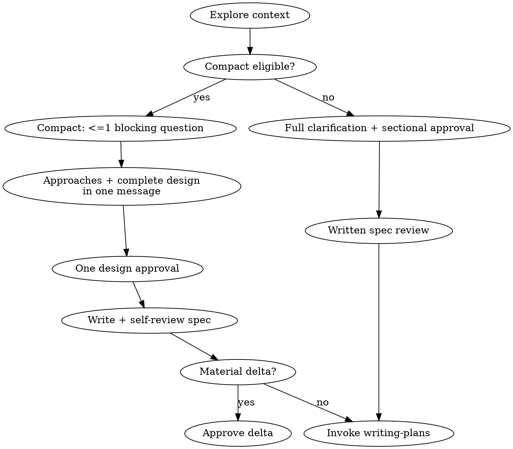

# Brainstorming Ideas Into Designs

Help turn ideas into approved designs and specs with interaction proportional
to uncertainty. Clear single-domain work uses Compact Flow; uncertain or
consequential design work uses Full Flow.

<HARD-GATE>
Do NOT invoke any implementation skill, write any code, scaffold any project, or take any implementation action until you have presented a design and the user has approved it. This applies to EVERY project regardless of perceived simplicity.
</HARD-GATE>

## Anti-Pattern: "This Is Too Simple To Need A Design"

Every project goes through this process. A todo list, a single-function utility, a config change — all of them. "Simple" projects are where unexamined assumptions cause the most wasted work. The design can be short (a few sentences for truly simple projects), but you MUST present it and get approval.

## Not a Trigger: Preparation-Only Requests

Do NOT use this skill when the user only asks you to familiarize yourself with context before providing requirements.

Examples: "熟悉开发规范，等下我给需求", "先熟悉这个模块", "先看看项目结构，不要改代码".

These mean: read context, optionally summarize, then wait. Do not ask design questions, propose approaches, create specs/plans, or transition to implementation skills until the user provides an actual build/change/fix request.

## Flow Selection

After exploring project context, choose one flow and state it internally in the
spec/plan as `Flow: Compact` or `Flow: Full`.

Use **Compact** only when all are true:

- one problem domain
- the goal and success criteria are clear, or one blocking question can make
  them clear
- no unresolved long-term architecture choice between materially different
  approaches
- no irreversible migration, security/permission boundary, protocol design,
  or major compatibility contract
- the user can directly evaluate the technical trade-offs

Use **Full** when any are true:

- multiple independent subsystems
- two or more unresolved blocking requirement questions
- several viable approaches materially affect long-term architecture
- irreversible migration, security, permissions, protocol, or major public
  compatibility risk
- the user explicitly requests a complete design process

Compact and Full are exhaustive: if any Compact eligibility condition is not
proven true, use Full. The list above names common mandatory Full signals; it is
not the complete complement.

New uncertainty upgrades Compact to Full. Never downgrade Full merely to save
time.

**Language Adaptation:** Determine the user's conversation language from the current session. Output all user-facing prose, documents (design doc, spec, review prompts), and scripted offers in that language. Code blocks, commands, and technical identifiers remain in their natural form (English).

## Checklist

Create todos only for applicable items:

1. Explore project context and select Compact or Full.
2. Offer the visual companion only when visual questions are likely.
3. Complete the selected design flow and obtain design approval.
4. Write and self-review the design spec.
5. If Full, or if the written Compact spec introduces a material delta, obtain
   written-spec approval.
6. Commit the spec only when explicitly authorized.
7. Invoke `k-superpowers:writing-plans`.

## Process Flow

**The terminal state is invoking writing-plans.** Do NOT invoke any implementation or domain-specific skill. The ONLY skill you invoke after brainstorming is writing-plans.

## The Process

### Compact Flow

- Ask at most one blocking question. If more are required, upgrade to Full.
- Present 2-3 approaches, recommendation, and the complete design in one
  message. Cover architecture, boundaries, data/control flow, failure handling,
  and verification in proportion to the task.
- Obtain one approval for that complete design. Do not ask for sectional
  approvals.
- Write the equivalent spec. If self-review finds no new architecture, scope,
  dependency, public contract, or risk decision, the chat approval also
  approves the faithful written spec.
- If the written spec contains a material delta, present only that delta for
  approval before planning.

### Full Flow

**Understanding the idea:**

- Check out the current project state first (files, docs, recent commits)
- Before asking detailed questions, assess scope: if the request describes multiple independent subsystems (e.g., "build a platform with chat, file storage, billing, and analytics"), flag this immediately. Don't spend questions refining details of a project that needs to be decomposed first.
- If the project is too large for a single spec, help the user decompose into sub-projects: what are the independent pieces, how do they relate, what order should they be built? Then brainstorm the first sub-project through the normal design flow. Each sub-project gets its own spec → plan → implementation cycle.
- For appropriately-scoped projects, ask questions one at a time to refine the idea
- Prefer multiple choice questions when possible, but open-ended is fine too
- Only one question per message - if a topic needs more exploration, break it into multiple questions
- Focus on understanding: purpose, constraints, success criteria

**Exploring approaches:**

- Propose 2-3 different approaches with trade-offs
- Present options conversationally with your recommendation and reasoning
- Lead with your recommended option and explain why

**Presenting the design:**

- Once you believe you understand what you're building, present the design
- Scale each section to its complexity: a few sentences if straightforward, up to 200-300 words if nuanced
- Ask after each section whether it looks right so far
- Cover: architecture, components, data flow, error handling, testing
- Be ready to go back and clarify if something doesn't make sense

**Design for isolation and clarity:**

- Break the system into smaller units that each have one clear purpose, communicate through well-defined interfaces, and can be understood and tested independently
- For each unit, you should be able to answer: what does it do, how do you use it, and what does it depend on?
- Can someone understand what a unit does without reading its internals? Can you change the internals without breaking consumers? If not, the boundaries need work.
- Smaller, well-bounded units are also easier for you to work with - you reason better about code you can hold in context at once, and your edits are more reliable when files are focused. When a file grows large, that's often a signal that it's doing too much.

**Working in existing codebases:**

- Explore the current structure before proposing changes. Follow existing patterns.
- Where existing code has problems that affect the work (e.g., a file that's grown too large, unclear boundaries, tangled responsibilities), include targeted improvements as part of the design - the way a good developer improves code they're working in.
- Don't propose unrelated refactoring. Stay focused on what serves the current goal.

## After the Design

**Documentation:**

- Write the validated design (spec) to `docs/superpowers/specs/YYYY-MM-DD-<topic>-design.md`
  - (User preferences for spec location override this default)
- Use elements-of-style:writing-clearly-and-concisely skill if available

**Spec Self-Review:**
After writing the spec document, look at it with fresh eyes:

1. **Placeholder scan:** Any "TBD", "TODO", incomplete sections, or vague requirements? Fix them.
2. **Internal consistency:** Do any sections contradict each other? Does the architecture match the feature descriptions?
3. **Scope check:** Is this focused enough for a single implementation plan, or does it need decomposition?
4. **Ambiguity check:** Could any requirement be interpreted two different ways? If so, pick one and make it explicit.

Fix any issues inline. No need to re-review — just fix and move on.

**Full / Delta User Review Gate:**
For Full Flow, or a Compact spec with a material delta, ask the user to review the written spec before proceeding. Localize the prompt into the user's conversation language while preserving these choices and authorization boundaries:
- Spec is written to `<path>`.
- Option 1 approves and commits the spec document.
- Option 2 requests changes.
- Option 3 approves without commit.
- Only option 1 authorizes a documentation-only commit.
- Approval of the spec does not authorize implementation.

Wait for the user's response. If they request changes, make them and re-run the
spec review loop. A faithful Compact spec skips this duplicate gate.

**Commit Gate (single source of truth for spec commits):**
Commit the spec document only when the user explicitly asks. Design approval,
including faithful Compact spec approval, never authorizes a commit.

**Implementation:**

- Invoke the writing-plans skill to create a detailed implementation plan
- Do NOT invoke any other skill. writing-plans is the next step.

## Key Principles

- **One blocking question in Compact; one question at a time in Full**
- **Multiple choice preferred** - Easier to answer than open-ended when possible
- **YAGNI ruthlessly** - Remove unnecessary features from all designs
- **Explore alternatives** - Always propose 2-3 approaches before settling
- **Incremental validation** - Present design, get approval before moving on
- **Be flexible** - Go back and clarify when something doesn't make sense

## Visual Companion

A browser-based companion for showing mockups, diagrams, and visual options during brainstorming. Available as a tool — not a mode. Accepting the companion means it's available for questions that benefit from visual treatment; it does NOT mean every question goes through the browser.

**Offering the companion:** When you anticipate that upcoming questions will involve visual content (mockups, layouts, diagrams), offer it once for consent. Localize this offer into the user's conversation language while preserving these points:
- Some upcoming work may be easier to explain visually in a browser.
- You can show mockups, diagrams, comparisons, or other visuals as needed.
- The feature is still new and can be token-intensive.
- Ask whether they want to try it.
- Mention that it requires opening a local URL.

**This offer MUST be its own message.** Do not combine it with clarifying questions, context summaries, or any other content. The message should contain ONLY the localized offer and nothing else. Wait for the user's response before continuing. If they decline, proceed with text-only brainstorming.

**Per-question decision:** Even after the user accepts, decide FOR EACH QUESTION whether to use the browser or the terminal. The test: **would the user understand this better by seeing it than reading it?**

- **Use the browser** for content that IS visual — mockups, wireframes, layout comparisons, architecture diagrams, side-by-side visual designs
- **Use the terminal** for content that is text — requirements questions, conceptual choices, tradeoff lists, A/B/C/D text options, scope decisions

A question about a UI topic is not automatically a visual question. "What does personality mean in this context?" is a conceptual question — use the terminal. "Which wizard layout works better?" is a visual question — use the browser.

If they agree to the companion, read the detailed guide before proceeding:
`skills/brainstorming/visual-companion.md`
