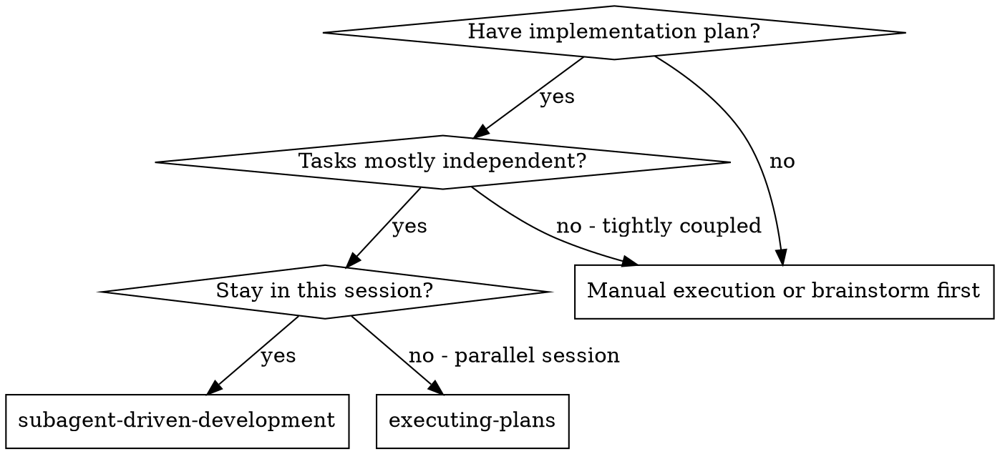
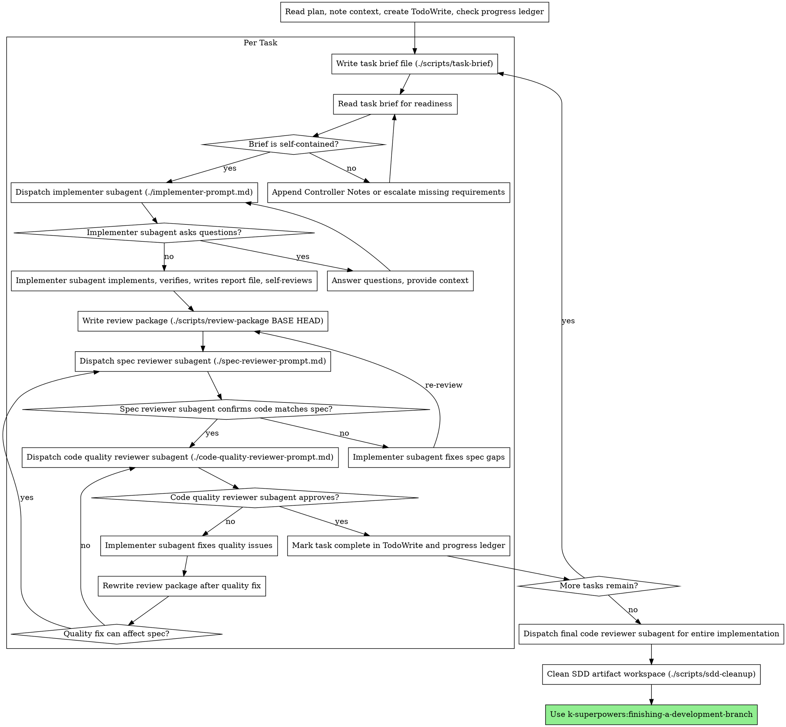

# Subagent-Driven Development

Execute plan by dispatching fresh subagent per task, with two-stage review after each: spec compliance review first, then code quality review.

**Why subagents:** You delegate tasks to specialized agents with isolated context. By precisely crafting their instructions and context, you ensure they stay focused and succeed at their task. They should never inherit your session's context or history — you construct exactly what they need. This also preserves your own context for coordination work.

**Core principle:** Fresh subagent per task + two-stage review (spec then quality) = high quality, fast iteration

**Context discipline:** Hand large artifacts to subagents as files: task briefs,
implementer reports, review packages, and the progress ledger live in the
short-lived `.superpowers/sdd/` workspace via the scripts in `./scripts/`.
After a successful SDD run, remove that workspace with `./scripts/sdd-cleanup`
so old ledgers and reports cannot pollute the next plan.

**Continuous execution:** Do not pause to check in with your human partner between tasks. Execute all tasks from the plan without stopping. The only reasons to stop are: BLOCKED status you cannot resolve, ambiguity that genuinely prevents progress, or all tasks complete. "Should I continue?" prompts and progress summaries waste their time — they asked you to execute the plan, so execute it.

## When to Use



**vs. Executing Plans (parallel session):**
- Same session (no context switch)
- Fresh subagent per task (no context pollution)
- Two-stage review after each task: spec compliance first, then code quality
- Faster iteration (no human-in-loop between tasks)

## The Process



## Pre-Flight Plan Review

Before dispatching Task 1, scan the plan once for conflicts:

- tasks that contradict each other or the plan's `Global Constraints`
- anything the plan explicitly mandates that reviewer discipline treats as a
  defect
- verification commands that conflict with project source of truth or broaden
  target/suite/matrix scope without saying so
- code comment/doc language or style that conflicts with project instructions
  or nearby files
- task ordering or interface assumptions that would make a later task impossible

Present everything you find to the human as one batched question, each finding
beside the plan text that mandates it, asking which governs. If the scan is
clean, proceed without comment. The review loop remains the net for conflicts
that only emerge from implementation.

## Model Selection

Use the least powerful model that can handle each role to conserve cost and increase speed.

**Mechanical implementation tasks** (isolated functions, clear specs, 1-2 files): use a fast, cheap model. Most implementation tasks are mechanical when the plan is well-specified.

**Integration and judgment tasks** (multi-file coordination, pattern matching, debugging): use a standard model.

**Architecture and design tasks:** use the most capable available model.

**Final whole-change review:** use the most capable available model.

**Review tasks:** choose the model by diff size, complexity, and risk. A small
mechanical diff does not need the most capable model; a subtle concurrency,
API, state, security, or cross-file change does.

**When the platform supports explicit model selection, specify it in every
subagent dispatch.** An omitted model may inherit the session's most expensive
model and silently defeat this section.

**Turn count beats token price.** Cheap models that take multiple clarification
or correction turns can cost more overall. Use the cheapest tier only when the
task is mechanical and the brief contains complete code or exact edits.

**Task complexity signals:**
- Touches 1-2 files with a complete spec → cheap model
- Touches multiple files with integration concerns → standard model
- Requires design judgment or broad codebase understanding → most capable model

## Handling Implementer Status

Implementer subagents report one of four statuses. Handle each appropriately:

**DONE:** Generate the review package with `./scripts/review-package BASE HEAD`
using the commit recorded before dispatching the implementer as `BASE`. Never
use `HEAD~1`; it drops all but the last commit of a multi-commit task. Then
dispatch the spec reviewer with the task brief path, report file path, and
review package path.

**DONE_WITH_CONCERNS:** The implementer completed the work but flagged doubts. Read the concerns before proceeding. If the concerns are about correctness or scope, address them before review. If they're observations (e.g., "this file is getting large"), note them and proceed to review.

**NEEDS_CONTEXT:** The implementer needs information that wasn't provided. Provide the missing context and re-dispatch.

**BLOCKED:** The implementer cannot complete the task. Assess the blocker:
1. If it's a context problem, provide more context and re-dispatch with the same model
2. If the task requires more reasoning, re-dispatch with a more capable model
3. If the task is too large, break it into smaller pieces
4. If the plan itself is wrong, escalate to the human

**Never** ignore an escalation or force the same model to retry without changes. If the implementer said it's stuck, something needs to change.

## Handling Spec Reviewer ⚠️ Items

The spec reviewer may report `⚠️ Cannot verify from diff` for requirements that
live in unchanged code or span tasks. These items do not automatically fail the
task, but the controller must resolve each one before marking the task
complete. Check the smallest concrete code or artifact needed, record what you
checked in the progress ledger or task notes, and if the item is a real gap,
treat it as a failed spec review.

## Reviewer Prompt Hygiene

Per-task reviews are task-scoped gates. The broad review happens once, at the
final whole-change review. When dispatching reviewers:

- Do not add open-ended directives like "check all uses" or "run race tests if
  useful" without a concrete, task-specific risk.
- Do not ask reviewers to re-run tests the implementer already ran on the same
  code. The implementer's report carries the verification evidence.
- Do not pre-judge findings for the reviewer. Never instruct a reviewer to
  ignore or not flag a specific issue. If a prompt contains "do not flag",
  "don't treat X as a defect", or "at most Minor", stop and remove the bias.
- Do not paste accumulated prior-task summaries into later dispatches. A fresh
  subagent needs the task brief, report file, review package, relevant
  interfaces, and global constraints.
- Record Minor findings in the progress ledger or task notes as you go, and
  point the final whole-change reviewer at that list for triage.
- A finding that conflicts with what the plan text requires is the human's
  decision: present the finding beside the plan text and ask which governs. Do
  not dismiss the finding because the plan mandates it, and do not dispatch a
  fix that contradicts the plan without asking.
- A plan requirement that conflicts with project source of truth is the same
  kind of conflict: present both sources and ask which governs.
- The final whole-change review gets a package too: run
  `./scripts/review-package MERGE_BASE HEAD`, where `MERGE_BASE` is the commit
  the branch started from, and include the printed path in the final review
  dispatch.
- If the final whole-change review returns findings, dispatch one fix subagent
  with the complete findings list. Do not create one fixer per finding.

## File Handoffs

Everything pasted into a dispatch prompt and everything a subagent prints back
stays resident in the controller's context. Hand bulky artifacts over as files:

- **Workspace:** run `./scripts/sdd-workspace` to create and print the
  per-worktree artifact directory at `.superpowers/sdd/`.
- **Task brief:** before dispatching an implementer, run
  `./scripts/task-brief PLAN_FILE N`. It writes the full task text to
  `.superpowers/sdd/task-N-brief.md` and prints the path. The generated brief
  includes the plan's `Global Constraints` followed by the full `Task N` text.
  The brief is the single source of task requirements; do not paste the full
  task into the dispatch prompt.
- **Brief readiness gate:** after generating the task brief, read it once before
  dispatching the implementer. The brief must be self-contained: it includes
  `Global Constraints`, the full task text, exact files, required manifest,
  docs, or version updates, dependency/API constraints, and verification
  commands with expected results and scope. If a required detail is missing but
  can be copied from the plan, append a `Controller Notes` section to the brief
  before dispatch. If it cannot be derived from the plan, stop and ask the
  human or revise the plan. If verification scope conflicts with CI, project
  scripts, package/task config, or memory, resolve it here before dispatch. Do
  not let the implementer infer missing requirements.
- **Report file:** name the implementer report after the brief
  (`task-N-brief.md` -> `task-N-report.md`) and include that path in the
  dispatch. The implementer writes the full report there and returns only
  status, commits if any, a one-line verification summary, concerns, and the
  report path.
- **Review package:** after implementation or fixes, run
  `./scripts/review-package BASE HEAD`. Pass the printed diff file path to
  reviewers instead of pasting `git diff` output into prompts.
- **Reviewer inputs:** both review stages receive the same task brief, report
  file, base/head SHAs, and review package path. Spec review judges requirement
  compliance first; code quality review still runs only after spec compliance
  passes.
- **Cleanup:** after every task is complete and the final whole-change reviewer
  approves, run `./scripts/sdd-cleanup`. It deletes `.superpowers/sdd/` for the
  current worktree so the next SDD run starts without stale briefs, reports,
  review packages, or `progress.md`.

## Review Loop Routing

Spec compliance remains the first gate:

- Any spec finding requires an implementer fix.
- After a spec fix, regenerate the review package and run spec review again.
- Run code quality review only after spec review passes.

Quality fixes route by risk:

- If the quality fix changes behavior, public API, config, manifests, tests,
  docs, touched files, or task scope, regenerate the review package and restart
  at spec review.
- If the quality fix is behavior-neutral standards work such as a local rename,
  extraction, comment/doc improvement, or cleanup, regenerate the review package
  and re-run code quality review only.
- When unsure, restart at spec review. Do not mark the task complete while
  either review axis has open issues.

## Durable Progress

Conversation memory can be compacted or lost mid-run. Track completed tasks in
the ledger file, not only in todos.

- At skill start, check for an existing ledger:
  `cat "$(./scripts/sdd-workspace)/progress.md" 2>/dev/null || true`.
- Tasks listed there as complete are DONE. Do not re-dispatch them; resume at
  the first task not marked complete.
- When a task's spec and code quality reviews are both clean, append one line:
  `Task N: complete (commits <base7>..<head7>, reviews clean)`.
- The ledger is ignored by git through `.superpowers/sdd/.gitignore`. If
  `git clean -fdx` deletes it, recover from git history and reviewer reports if
  available.
- Treat `.superpowers/sdd/` as resume state for the current unfinished SDD run,
  not as durable project history. Do not clean it while tasks, review loops, or
  blockers remain. Once the whole SDD run succeeds, `./scripts/sdd-cleanup`
  removes it so future plans cannot mistake old `progress.md` entries for
  current work.

## Prompt Templates

- `./implementer-prompt.md` - Dispatch implementer subagent
- `./spec-reviewer-prompt.md` - Dispatch spec compliance reviewer subagent
- `./code-quality-reviewer-prompt.md` - Dispatch code quality reviewer subagent

## Example Workflow

```
You: I'm using Subagent-Driven Development to execute this plan.

[Read plan file once: docs/superpowers/plans/feature-plan.md]
[Check .superpowers/sdd/progress.md for completed tasks]
[Create TodoWrite with all tasks]

Task 1: Hook installation script

[Run ./scripts/task-brief docs/superpowers/plans/feature-plan.md 1]
[Read .superpowers/sdd/task-1-brief.md and confirm it includes Global Constraints, exact files, and verification. Append Controller Notes if the plan contains required details not present in the brief.]
[Dispatch implementation subagent with task brief path + report file path + context]

Implementer: "Before I begin - should the hook be installed at user or system level?"

You: "User level (~/.config/superpowers/hooks/)"

Implementer: "Got it. Implementing now..."
[Later] Implementer:
  - Implemented install-hook command
  - Added tests, 5/5 passing
  - Self-review: Found I missed --force flag, added it
  - Report written to .superpowers/sdd/task-1-report.md

[Run ./scripts/review-package <base> HEAD]
[Dispatch spec compliance reviewer with brief/report/diff paths]
Spec reviewer: ✅ Spec compliant - all requirements met, nothing extra

[Dispatch code quality reviewer with same brief/report/diff paths]
Code reviewer: Strengths: Good test coverage, clean. Issues: None. Approved.

[Mark Task 1 complete in TodoWrite and .superpowers/sdd/progress.md]

Task 2: Recovery modes

[Run ./scripts/task-brief docs/superpowers/plans/feature-plan.md 2]
[Dispatch implementation subagent with task brief path + report file path + context]

Implementer: [No questions, proceeds]
Implementer:
  - Added verify/repair modes
  - 8/8 tests passing
  - Self-review: All good
  - Report written to .superpowers/sdd/task-2-report.md

[Run ./scripts/review-package <base> HEAD]
[Dispatch spec compliance reviewer with brief/report/diff paths]
Spec reviewer: ❌ Issues:
  - Missing: Progress reporting (spec says "report every 100 items")
  - Extra: Added --json flag (not requested)

[Implementer fixes issues]
Implementer: Removed --json flag, added progress reporting, appended verification to report

[Run ./scripts/review-package <base> HEAD]
[Spec reviewer reviews same brief/report and updated diff package]
Spec reviewer: ✅ Spec compliant now

[Dispatch code quality reviewer with same brief/report/diff paths]
Code reviewer: Strengths: Solid. Issues (Important): Magic number (100)

[Implementer fixes]
Implementer: Extracted PROGRESS_INTERVAL constant, appended verification to report

[Run ./scripts/review-package <base> HEAD]
[Behavior-neutral quality fix: re-run code quality review with same brief/report and updated diff package]
Code reviewer: ✅ Approved

[Mark Task 2 complete]

...

[After all tasks]
[Dispatch final code-reviewer]
Final reviewer: All requirements met, ready to merge

[Run ./scripts/sdd-cleanup]
Cleanup: removed .superpowers/sdd

Done!
```

## Advantages

**vs. Manual execution:**
- Subagents follow type-first verification naturally
- Fresh context per task (no confusion)
- Parallel-safe (subagents don't interfere)
- Subagent can ask questions (before AND during work)

**vs. Executing Plans:**
- Same session (no handoff)
- Continuous progress (no waiting)
- Review checkpoints automatic

**Efficiency gains:**
- Less resident context (briefs, reports, and diffs move through files)
- Controller curates exactly what context is needed
- Subagent gets complete information upfront
- Questions surfaced before work begins (not after)
- Progress ledger lets the controller resume after context compaction

**Quality gates:**
- Self-review catches issues before handoff
- Two-stage review: spec compliance, then code quality
- Review loops ensure fixes actually work
- Spec compliance prevents over/under-building
- Code quality ensures implementation is well-built

**Cost:**
- More subagent invocations (implementer + 2 reviewers per task)
- Controller does more prep work (extracting all tasks upfront)
- Review loops add iterations
- But catches issues early (cheaper than debugging later)

## Red Flags

**Never:**
- Start implementation on main/master branch without explicit user consent
- Skip reviews (spec compliance OR code quality)
- Dispatch an implementer before reading the generated brief for readiness
- Proceed with unfixed issues
- Dispatch multiple implementation subagents in parallel (conflicts)
- Make subagent read the full plan file (provide a task brief file instead)
- Paste full task text, reports, or diffs into dispatches when a file path will do
- Bias a reviewer prompt by telling the reviewer what not to flag, how severe a
  finding may be, or which plan-mandated issue to ignore
- Dispatch a reviewer without a review package file
- Leave `⚠️ Cannot verify from diff` items unresolved
- Drop Minor findings without recording them for final review triage
- Re-dispatch tasks already marked complete in `.superpowers/sdd/progress.md`
- Leave `.superpowers/sdd/` in place after the final whole-change reviewer
  approves the completed SDD run
- Clean `.superpowers/sdd/` while the run is blocked, interrupted, mid-review,
  or otherwise incomplete
- Skip scene-setting context (subagent needs to understand where task fits)
- Ignore subagent questions (answer before letting them proceed)
- Accept "close enough" on spec compliance (spec reviewer found issues = not done)
- Skip review loops (reviewer found issues = implementer fixes = review again)
- Let implementer self-review replace actual review (both are needed)
- **Start code quality review before spec compliance is ✅** (wrong order)
- Skip spec re-review after a quality fix that changes behavior, API, config,
  manifests, tests, docs, touched files, or task scope
- Move to next task while either review has open issues

**If subagent asks questions:**
- Answer clearly and completely
- Provide additional context if needed
- Don't rush them into implementation

**If reviewer finds issues:**
- Implementer (same subagent) fixes them
- Reviewer reviews again
- Repeat until approved
- Don't skip the re-review

**If subagent fails task:**
- Dispatch fix subagent with specific instructions
- Don't try to fix manually (context pollution)

## Integration

**Required workflow skills:**
- **k-superpowers:using-git-worktrees** - Ensures isolated workspace (creates one or verifies existing)
- **k-superpowers:writing-plans** - Creates the plan this skill executes
- **k-superpowers:requesting-code-review** - Code review template for reviewer subagents
- **k-superpowers:finishing-a-development-branch** - Complete development after all tasks

**Subagents should use:**
- **k-superpowers:type-driven-verification** - Subagents use type-first verification for each task

**Alternative workflow:**
- **k-superpowers:executing-plans** - Use for parallel session instead of same-session execution
