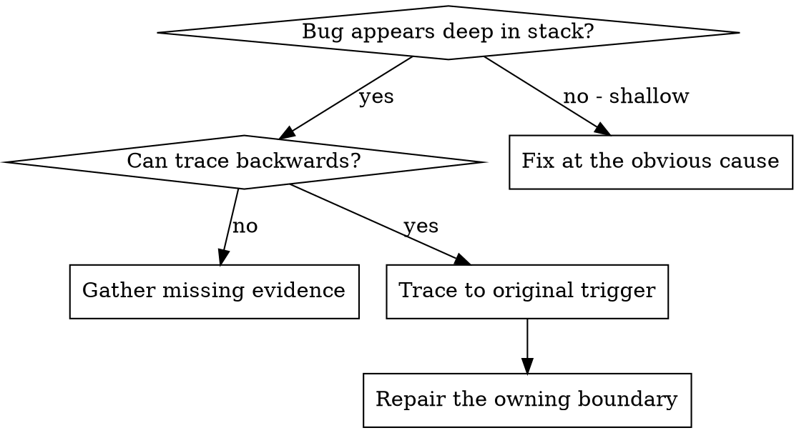
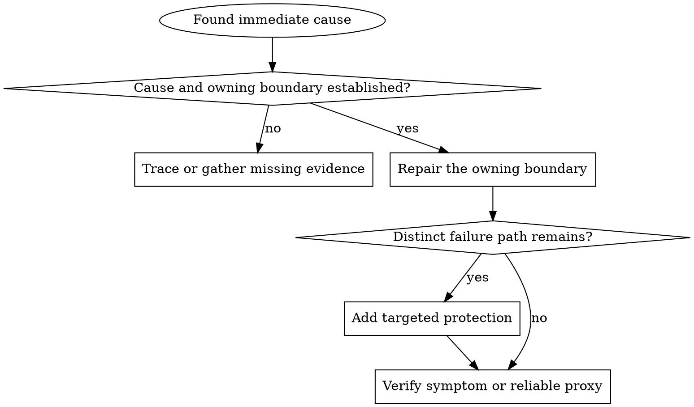

# Root Cause Tracing

## Overview

Bugs often manifest deep in the call stack: git init in the wrong directory, a
file created in the wrong location, or a database opened with the wrong path.
Trace how the bad state reached the failing operation before choosing where to
repair it.

**Core principle:** Trace bad state toward its source, then repair the boundary that owns the violated invariant.

## When to Use



**Use when:**
- Error happens deep in execution (not at entry point)
- Stack trace shows long call chain
- Unclear where invalid data originated
- Need to find which test/code triggers the problem

## The Tracing Process

### 1. Observe the Symptom
```
Error: git init failed in ~/project/packages/core
```

### 2. Find Immediate Cause
**What code directly causes this?**
```typescript
await execFileAsync('git', ['init'], { cwd: projectDir });
```

### 3. Ask: What Called This?
```typescript
WorktreeManager.createSessionWorktree(projectDir, sessionId)
  → called by Session.initializeWorkspace()
  → called by Session.create()
  → called by test at Project.create()
```

### 4. Keep Tracing Up
**What value was passed?**
- `projectDir = ''` (empty string!)
- Empty string as `cwd` resolves to `process.cwd()`
- That's the source code directory!

### 5. Find Original Trigger
**Where did empty string come from?**
```typescript
const context = setupCoreTest(); // Returns { tempDir: '' }
Project.create('name', context.tempDir); // Accessed before beforeEach!
```

## Adding Stack Traces

When you can't trace manually, add instrumentation:

```typescript
// Before the problematic operation
async function gitInit(directory: string) {
  const stack = new Error().stack;
  console.error('DEBUG git init:', {
    directory,
    cwd: process.cwd(),
    nodeEnv: process.env.NODE_ENV,
    stack,
  });

  await execFileAsync('git', ['init'], { cwd: directory });
}
```

**Critical:** Use `console.error()` in tests (not logger - may not show)

**Run and capture:**
```bash
npm test 2>&1 | grep 'DEBUG git init'
```

**Analyze stack traces:**
- Look for test file names
- Find the line number triggering the call
- Identify the pattern (same test? same parameter?)

## Finding Which Test Causes Pollution

If something appears during tests but you don't know which test:

Use the bisection script `find-polluter.sh` in this directory:

```bash
./find-polluter.sh '.git' 'src/**/*.test.ts'
```

Runs tests one-by-one, stops at first polluter. See script for usage.

## Real Example: Empty projectDir

**Symptom:** `.git` created in `packages/core/` (source code)

**Trace chain:**
1. `git init` runs in `process.cwd()` ← empty cwd parameter
2. WorktreeManager called with empty projectDir
3. Session.create() passed empty string
4. Test accessed `context.tempDir` before beforeEach
5. setupCoreTest() returns `{ tempDir: '' }` initially

**Root cause:** Top-level variable initialization accessing empty value

**Fix:** Made tempDir a getter that throws if accessed before beforeEach

**Historical additional checks and instrumentation:**
- Layer 1: Project.create() validates directory
- Layer 2: WorkspaceManager validates not empty
- Layer 3: NODE_ENV guard refuses git init outside tmpdir
- Layer 4: Stack trace logging before git init

These were choices made in that session, not required layers for every fix.
Each additional guard needs a distinct failure path; logging provides diagnostic
evidence rather than enforcing the invariant.

## Key Principle

Use `type-driven-verification` to choose the type/API boundary or runtime guard
that owns the invariant. Add another check only for a concrete bypass, a separate
trust boundary, or state that can change after earlier validation. Repeating the
same check along an already-protected path adds no independent guarantee.
Use [defense-in-depth.md](defense-in-depth.md) when such a remaining risk needs
additional protection.



Do not mistake symptom suppression for a cause-based fix. Stop tracing when the
evidence establishes the responsible boundary; report missing evidence when it
does not, following the main skill's stop conditions.

## Stack Trace Tips

**In tests:** Use `console.error()` not logger - logger may be suppressed
**Before operation:** Log before the dangerous operation, not after it fails
**Include context:** Directory, cwd, environment variables, timestamps
**Capture stack:** `new Error().stack` shows complete call chain

## Real-World Impact

From debugging session (2025-10-03):
- Found root cause through 5-level trace
- Fixed at source (getter validation)
- Added checks and diagnostic instrumentation at four locations
- Reported 1847 tests passing with no pollution observed; this does not prove
  every recurrence path is excluded
