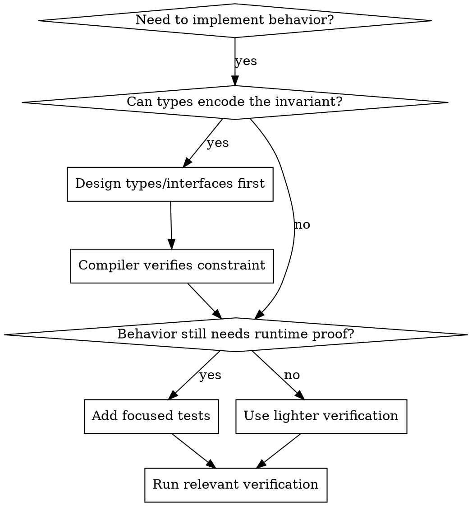

# Type-Driven Verification

## Overview

Prefer type-driven design and compiler-enforced invariants. Write tests where behavior cannot be proven by types, or where regressions would be costly.

**Core principle:** Make invalid states unrepresentable first. Test core behavior and risks the type system cannot prove.

This skill keeps the historical name `test-driven-development` for compatibility with existing references, but this fork does NOT require strict test-first TDD for every change.

## When to Use

Use explicit verification for:
- Core business logic
- Public API behavior
- Bug regressions
- Algorithms, parsers, serializers, protocols
- State machines and edge-heavy logic
- High-risk refactors
- Logic where types cannot express the invariant

Tests are optional for:
- Simple glue code
- Mechanical changes
- Documentation and config changes
- Code whose correctness is enforced by types
- Private helpers covered through public behavior
- Exploratory API/type design

## The Priority Order

## Type-First Design

Before tests, ask:
- Can this invalid state be impossible to construct?
- Should this be a newtype instead of a primitive?
- Is this a state machine enum instead of booleans?
- Can ownership, lifetimes, visibility, or trait bounds enforce the rule?
- Can the public API make misuse hard?

Examples of type-level protection:
- `ValidatedEmail` instead of `String`
- `NonEmptyVec<T>` instead of `Vec<T>` when empty is invalid
- `enum ConnectionState { Disconnected, Connecting, Connected(Session) }` instead of flags
- Private fields with checked constructors
- Trait bounds that encode required capabilities

## When to Write Tests

Write tests when they protect meaningful behavior:
- Regression test for a bug that can recur
- Unit tests for core pure logic
- Integration tests for public flows
- Property tests for parsers, serializers, protocols, and algorithms
- Snapshot/golden tests when output stability matters

Good tests should:
- Exercise public behavior where possible
- Cover edge cases that matter
- Be stable in CI
- Fail when core semantics are changed incorrectly
- Avoid testing mocks instead of real behavior

Avoid tests that:
- Only mirror implementation details
- Lock down private helper structure
- Require excessive mocking
- Make simple refactors expensive without protecting behavior
- Exist only to satisfy a blanket coverage rule

## Bug Fixes

For bugs, first use `superpowers:systematic-debugging` to find root cause.

Then choose the verification level:
- Core or recurring bug: add a regression test before or alongside the fix.
- Type-level bug: encode the missing invariant in types, then compile and run relevant tests.
- Simple wiring/config bug: run the smallest command that reproduces and verifies the fix.

Do not ship bug fixes based only on confidence. Some fresh verification must demonstrate the symptom is gone.

## Implementation Pattern

1. Clarify the behavior or invariant.
2. Encode what you can in types, interfaces, visibility, and ownership.
3. Identify what the compiler cannot prove.
4. Add focused tests only for those behavioral risks.
5. Implement the minimal change.
6. Run the relevant verification: compiler, linter, unit tests, integration tests, or reproduction command.

## Verification Checklist

Before marking work complete:
- [ ] Invalid states are prevented by types where practical
- [ ] Public API boundaries are clear
- [ ] Core behavior has tests when regressions would be costly
- [ ] Bug fixes have regression coverage or a clear reproduction verification
- [ ] Relevant verification commands were run freshly
- [ ] Tests are stable and protect behavior, not incidental implementation

## Common Mistakes

| Mistake | Fix |
|---------|-----|
| Testing everything by default | Test core behavior and risks |
| Relying only on tests | Move invariants into types where possible |
| Relying only on types | Test runtime behavior types cannot prove |
| Testing private helpers | Test through public behavior unless isolation is valuable |
| Mock-heavy tests | Prefer real behavior or simpler boundaries |
| No regression check for core bug | Add focused regression test or reproduction command |

## Bottom Line

Tests are valuable when they protect important behavior. They are not a ritual.

Prefer types first. Test what types cannot prove. Verify before claiming success.
