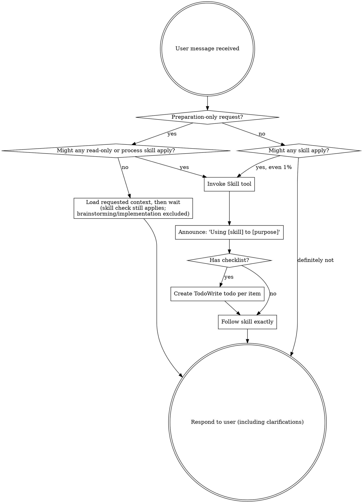

<SUBAGENT-STOP>
If you were dispatched as a subagent to execute a specific task, skip this skill.
</SUBAGENT-STOP>

<EXTREMELY-IMPORTANT>
If you think there is even a 1% chance a skill might apply to what you are doing, you ABSOLUTELY MUST invoke the skill.

IF A SKILL APPLIES TO YOUR TASK, YOU DO NOT HAVE A CHOICE. YOU MUST USE IT.

This is not negotiable. This is not optional. You cannot rationalize your way out of this.
</EXTREMELY-IMPORTANT>

## Instruction Priority

Superpowers skills override default system prompt behavior, but **user instructions always take precedence**:

1. **User's explicit instructions** (CLAUDE.md, AGENTS.md, direct requests) — highest priority
2. **Superpowers skills** — override default system behavior where they conflict
3. **Default system prompt** — lowest priority

If CLAUDE.md or AGENTS.md conflicts with a skill's guidance, follow the user's instructions. The user is in control.

## How to Access Skills

**In Claude Code:** Use the `Skill` tool. When you invoke a skill, its content is loaded and presented to you—follow it directly. Never use the Read tool on skill files.

**In Copilot CLI:** Use the `skill` tool. Skills are auto-discovered from installed plugins. The `skill` tool works the same as Claude Code's `Skill` tool.

**In other environments:** Check your platform's documentation for how skills are loaded.

## Platform Adaptation

Skills use Claude Code tool names. Non-CC platforms: see `references/copilot-tools.md` (Copilot CLI), `references/codex-tools.md` (Codex) for tool equivalents.

# Using Skills

## The Rule

**Invoke relevant or requested skills BEFORE any response or action.** Even a 1% chance a skill might apply means that you should invoke the skill to check. If an invoked skill turns out to be wrong for the situation, you don't need to use it.

## Intent Gate

Before invoking downstream skills, classify the user's intent.

If the user is only asking you to familiarize yourself with context, read docs, inspect code, learn conventions, or wait for a later requirement, do NOT invoke brainstorming or implementation skills yet.

Examples: "熟悉开发规范，等下我给需求", "先熟悉这个模块", "先看看项目结构，不要改代码".

For preparation-only requests: load only the requested context, summarize if useful, then stop and wait. Do not ask design questions, propose approaches, or create specs/plans. The skill check itself still applies — process or read-only skills may assist preparation; only brainstorming and implementation skills are excluded until an actual build/change request arrives.

Only invoke `brainstorming` after an actual creative/build/change request: "实现 X", "设计 Y", "修复 Z", "添加功能", or "改成...".

## EnterPlanMode Gate

Before calling EnterPlanMode (or any platform plan mode) for creative/build/change work: if the design has not been brainstormed and approved yet, invoke `k-superpowers:brainstorming` first. Plan mode does not replace the design gate.

## Red Flags

These thoughts mean STOP—you're rationalizing:

| Thought | Reality |
|---------|---------|
| "This is just a simple question" | Questions are tasks. Check for skills. |
| "I need more context first" | Skill check comes BEFORE clarifying questions. |
| "Let me explore the codebase first" | Skills tell you HOW to explore. Check first. |
| "I can check git/files quickly" | Files lack conversation context. Check for skills. |
| "Let me gather information first" | Skills tell you HOW to gather information. |
| "This doesn't need a formal skill" | If a skill exists, use it. |
| "I remember this skill" | Skills evolve. Read current version. |
| "This doesn't count as a task" | Action = task. Check for skills. |
| "The skill is overkill" | Simple things become complex. Use it. |
| "I'll just do this one thing first" | Check BEFORE doing anything. |
| "This feels productive" | Undisciplined action wastes time. Skills prevent this. |
| "I know what that means" | Knowing the concept ≠ using the skill. Invoke it. |

## Skill Priority

When multiple skills could apply, use this order:

1. **Process skills first** (brainstorming, debugging) - these determine HOW to approach the task
2. **Implementation skills second** (domain- or technology-specific skills from other plugins) - these guide execution

"Let's build X" → brainstorming first, then implementation skills.
"Fix this bug" → debugging first, then domain-specific skills.

## Skill Types

**Rigid** (verification, debugging): Follow exactly. Don't adapt away discipline.

**Flexible** (patterns): Adapt principles to context.

The skill itself tells you which.

## User Instructions

Instructions say WHAT, not HOW. "Add X" or "Fix Y" doesn't mean skip workflows.
