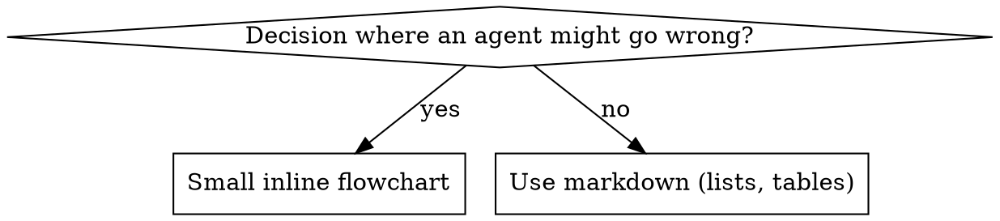

# Writing Skills

## Overview

**Writing skills uses risk-matched verification for process documentation.**

**Personal skills live in agent-specific directories (`~/.claude/skills` for Claude Code, `~/.agents/skills/` for Codex)** 

For new behavior-shaping skills and high-risk changes without observed failure
evidence: create pressure scenarios with subagents, watch baseline behavior fail
without guidance, write the skill documentation, verify agents comply, then
close loopholes. When a real user report, production incident, agent transcript,
or review finding already shows the failure, treat that as baseline evidence and
verify the fix against that failure. For lower-risk edits, lighter verification
applies — see The Iron Law below.

**Core principle:** For behavior-shaping content, if you didn't watch an agent fail without the skill, you don't know if the skill teaches the right thing.

**REQUIRED BACKGROUND:** Understand `k-superpowers:type-driven-verification`. This skill applies the same verification discipline to process documentation.

**Official guidance:** For Anthropic's official skill authoring best practices, see anthropic-best-practices.md. This document provides additional patterns and guidelines that complement the verification-focused approach in this skill.

## What is a Skill?

A **skill** is a reference guide for proven techniques, patterns, or tools. Skills help future Claude instances find and apply effective approaches.

**Skills are:** Reusable techniques, patterns, tools, reference guides

**Skills are NOT:** Narratives about how you solved a problem once

## Verification Mapping for Skills

| Verification Concept | Skill Creation |
|-------------|----------------|
| **Test case** | Pressure scenario with subagent |
| **Production code** | Skill document (SKILL.md) |
| **Failing baseline** | Agent violates rule without skill — document exact rationalizations |
| **Passing verification** | Agent complies with skill present |
| **Close loopholes** | Find new rationalizations → plug → re-verify |

High-risk skill changes follow this full baseline → write → verify → close-loopholes loop. Lower-risk changes use lighter verification — see The Iron Law below.

## Mode Selection

Choose the mode before editing anything:

| Mode | Use when | First action |
|---|---|---|
| **Create new skill** | No existing skill covers the technique, pattern, or reference | Check whether a skill is the right artifact |
| **Edit existing skill** | Improving behavior, wording, triggers, workflow, examples, references, or verification guidance in an existing skill | Read the existing skill and identify current invariants |
| **Verify existing skill** | Testing whether a skill works before deployment or after a change | Choose verification by skill type and risk |
| **Review only** | Asked to critique or assess a skill without changing it | Report findings and risks; do not edit |

If the task is edit, verify, or review-only, do not drift into creating a new
skill unless the existing skill is demonstrably the wrong artifact.

## Editing Existing Skills

Existing skills already shape behavior. Preserve their valid behavior while
changing only the targeted failure.

Before editing an existing skill:

1. Read the target `SKILL.md` and relevant supporting files.
2. State the current invariants the edit must preserve.
3. Identify affected surfaces: trigger conditions, workflow gates, subagent
   behavior, verification requirements, examples, cross-references, or
   deployment instructions.
4. State the observed failure or desired behavior change.
5. Classify risk by behavioral effect, not diff size.
6. Choose verification strength from The Iron Law.

Prefer minimal, local edits. Do not rewrite unrelated sections for taste while
fixing a specific behavior.

## When to Create a Skill

**Create when:**
- Technique wasn't intuitively obvious to you
- You'd reference this again across projects
- Pattern applies broadly (not project-specific)
- Others would benefit

**Don't create for:**
- One-off solutions
- Standard practices well-documented elsewhere
- Project-specific conventions (put in CLAUDE.md)
- Mechanical constraints (if it's enforceable with regex/validation, automate it—save documentation for judgment calls)

## Skill Types

### Technique
Concrete method with steps to follow (condition-based-waiting, root-cause-tracing)

### Pattern
Way of thinking about problems (flatten-with-flags, test-invariants)

### Reference
API docs, syntax guides, tool documentation (office docs)

## Directory Structure


```
skills/
  skill-name/
    SKILL.md              # Main reference (required)
    supporting-file.*     # Only if needed
```

**Flat namespace** - all skills in one searchable namespace

**Separate files for:**
1. **Heavy reference** (100+ lines) - API docs, comprehensive syntax
2. **Reusable tools** - Scripts, utilities, templates

**Keep inline:**
- Principles and concepts
- Code patterns (< 50 lines)
- Everything else

## SKILL.md Structure

**Frontmatter (YAML):**
- Two required fields: `name` and `description` (see [agentskills.io/specification](https://agentskills.io/specification) for all supported fields)
- Max 1024 characters total
- `name`: Use letters, numbers, and hyphens only (no parentheses, special chars)
- `description`: Third-person, describes ONLY when to use (NOT what it does)
  - Start with "Use when..." to focus on triggering conditions
  - Include specific symptoms, situations, and contexts
  - **NEVER summarize the skill's process or workflow** (see CSO section for why)
  - Keep under 500 characters if possible

```markdown
---
name: Skill-Name-With-Hyphens
description: Use when [specific triggering conditions and symptoms]
---

# Skill Name

## Overview
What is this? Core principle in 1-2 sentences.

## When to Use
[Small inline flowchart IF decision non-obvious]

Bullet list with SYMPTOMS and use cases
When NOT to use

## Core Pattern (for techniques/patterns)
Before/after code comparison

## Quick Reference
Table or bullets for scanning common operations

## Implementation
Inline code for simple patterns
Link to file for heavy reference or reusable tools

## Common Mistakes
What goes wrong + fixes

## Real-World Impact (optional)
Concrete results
```


## Claude Search Optimization (CSO)

**Critical for discovery:** Future Claude needs to FIND your skill

### 1. Rich Description Field

**Purpose:** Claude reads description to decide which skills to load for a given task. Make it answer: "Should I read this skill right now?"

**Format:** Start with "Use when..." to focus on triggering conditions

**CRITICAL: Description = When to Use, NOT What the Skill Does**

The description should ONLY describe triggering conditions. Do NOT summarize the skill's process or workflow in the description.

**Why this matters:** Testing revealed that when a description summarizes the skill's workflow, Claude may follow the description instead of reading the full skill content. A description saying "code review between tasks" caused Claude to do ONE review, even though the skill's flowchart clearly showed TWO reviews (spec compliance then code quality).

When the description was changed to just "Use when executing implementation plans with independent tasks" (no workflow summary), Claude correctly read the flowchart and followed the two-stage review process.

**The trap:** Descriptions that summarize workflow create a shortcut Claude will take. The skill body becomes documentation Claude skips.

```yaml
# ❌ BAD: Summarizes workflow - Claude may follow this instead of reading skill
description: Use when executing plans - dispatches subagent per task with code review between tasks

# ❌ BAD: Too much process detail
description: Use for skill writing - run baseline scenarios, write guidance, verify compliance

# ✅ GOOD: Just triggering conditions, no workflow summary
description: Use when executing implementation plans with independent tasks in the current session

# ✅ GOOD: Triggering conditions only
description: Use when implementing any feature or bugfix, before writing implementation code
```

**Content:**
- Use concrete triggers, symptoms, and situations that signal this skill applies
- Describe the *problem* (race conditions, inconsistent behavior) not *language-specific symptoms* (setTimeout, sleep)
- Keep triggers technology-agnostic unless the skill itself is technology-specific
- If skill is technology-specific, make that explicit in the trigger
- Write in third person (injected into system prompt)
- **NEVER summarize the skill's process or workflow**

```yaml
# ❌ BAD: Too abstract, vague, doesn't include when to use
description: For async testing

# ❌ BAD: First person
description: I can help you with async tests when they're flaky

# ❌ BAD: Mentions technology but skill isn't specific to it
description: Use when tests use setTimeout/sleep and are flaky

# ✅ GOOD: Starts with "Use when", describes problem, no workflow
description: Use when tests have race conditions, timing dependencies, or pass/fail inconsistently

# ✅ GOOD: Technology-specific skill with explicit trigger
description: Use when using React Router and handling authentication redirects
```

### 2. Keyword Coverage

Use words Claude would search for:
- Error messages: "Hook timed out", "ENOTEMPTY", "race condition"
- Symptoms: "flaky", "hanging", "zombie", "pollution"
- Synonyms: "timeout/hang/freeze", "cleanup/teardown/afterEach"
- Tools: Actual commands, library names, file types

### 3. Descriptive Naming

**Use active voice, verb-first:**
- ✅ `creating-skills` not `skill-creation`
- ✅ `condition-based-waiting` not `async-test-helpers`
- ✅ `flatten-with-flags` not `data-structure-refactoring`

**Gerunds (-ing) work well for processes:** `creating-skills`, `debugging-with-logs` — active, describes the action you're taking.

### 4. Token Efficiency (Critical)

**Problem:** getting-started and frequently-referenced skills load into EVERY conversation. Every token counts.

**Target word counts:**
- getting-started workflows: <150 words each
- Frequently-loaded skills: <200 words total
- Other skills: <500 words (still be concise)

**Techniques:**

**Move details to tool help:**
```bash
# ❌ BAD: Document all flags in SKILL.md
search-conversations supports --text, --both, --after DATE, --before DATE, --limit N

# ✅ GOOD: Reference --help
search-conversations supports multiple modes and filters. Run --help for details.
```

**Use cross-references:**
```markdown
# ❌ BAD: Repeat workflow details
When searching, dispatch subagent with template...
[20 lines of repeated instructions]

# ✅ GOOD: Reference other skill
Always use subagents (50-100x context savings). REQUIRED: Use [other-skill-name] for workflow.
```

**Eliminate redundancy:**
- Don't repeat what's in cross-referenced skills
- Don't explain what's obvious from command
- Don't include multiple examples of same pattern
- Compress dialogue examples to their skeleton

**Verification:**
```bash
wc -w skills/path/SKILL.md
# getting-started workflows: aim for <150 each
# Other frequently-loaded: aim for <200 total
```

### 5. Cross-Referencing Other Skills

**When writing documentation that references other skills:**

Use skill name only, with explicit requirement markers:
- ✅ Good: `**REQUIRED SUB-SKILL:** Use k-superpowers:type-driven-verification`
- ✅ Good: `**REQUIRED BACKGROUND:** You MUST understand k-superpowers:systematic-debugging`
- ❌ Bad: `See skills/type-driven-verification` (unclear if required)
- ❌ Bad: `@skills/type-driven-verification/SKILL.md` (force-loads, burns context)

**Why no @ links:** `@` syntax force-loads files immediately, consuming 200k+ context before you need them.

## Flowchart Usage



**Use flowcharts ONLY for:**
- Non-obvious decision points
- Process loops where you might stop too early
- "When to use A vs B" decisions

**Never use flowcharts for:**
- Reference material → Tables, lists
- Code examples → Markdown blocks
- Linear instructions → Numbered lists
- Labels without semantic meaning (step1, helper2)

See `graphviz-conventions.dot` for graphviz style rules.

**Visualizing for your human partner:** Use `render-graphs.js` in this directory to render a skill's flowcharts to SVG:
```bash
./render-graphs.js ../some-skill           # Each diagram separately
./render-graphs.js ../some-skill --combine # All diagrams in one SVG
```

## Code Examples

**One excellent example beats many mediocre ones**

Choose most relevant language:
- Testing techniques → TypeScript/JavaScript
- System debugging → Shell/Python
- Data processing → Python

**Good example:**
- Complete and runnable
- Well-commented explaining WHY
- From real scenario
- Shows pattern clearly
- Ready to adapt (not generic template)

**Don't:**
- Implement in 5+ languages
- Create fill-in-the-blank templates
- Write contrived examples

You're good at porting - one great example is enough.

## File Organization

### Self-Contained Skill
```
defense-in-depth/
  SKILL.md    # Everything inline
```
When: All content fits, no heavy reference needed

### Skill with Reusable Tool
```
condition-based-waiting/
  SKILL.md    # Overview + patterns
  example.ts  # Working helpers to adapt
```
When: Tool is reusable code, not just narrative

### Skill with Heavy Reference
```
pptx/
  SKILL.md       # Overview + workflows
  pptxgenjs.md   # 600 lines API reference
  ooxml.md       # 500 lines XML structure
  scripts/       # Executable tools
```
When: Reference material too large for inline

## The Iron Law

```
VERIFICATION STRENGTH MUST MATCH BEHAVIORAL RISK — AND IS NEVER ZERO
```

This applies to NEW skills AND EDITS to existing skills.

Before any skill change, state explicitly:
1. The invariant(s) the change must preserve
2. The trigger conditions it could affect
3. The failure mode if it goes wrong

Then match verification to risk:

| Risk tier | Typical changes | Required verification |
|-----------|-----------------|----------------------|
| **Low** — wording, formatting, fixing dead links/references | Rename a heading, fix a typo, update a path | Static review against stated invariants + search for now-conflicting wording |
| **Medium** — process gates, checklists, cross-references, reordering steps | Add an approval gate, restructure a flow | Static review + counterexample walk-through: "how could an agent misread this?" |
| **High** — trigger conditions, discipline rules, rationalization tables, subagent flows, new behavior-shaping skills | New discipline skill, editing descriptions, changing when a skill fires | Baseline pressure scenarios BEFORE writing + compliance verification after (see testing-skills-with-subagents.md) |

**No zero tier:** "it's obviously fine" is not a verification level. Every change gets at least static review with explicitly stated invariants.

**No tier-shopping:** if a "wording" change alters when an agent would invoke, skip, or rationalize around the skill, it IS a trigger-condition change — high risk. Classify by effect, not by diff size.

For high-risk changes, baseline evidence may be either observed or synthetic:

- **Observed evidence:** real user reports, production incidents, agent
  transcripts, failed evals, or review findings that show the failure mode.
- **Synthetic evidence:** pressure scenarios created before writing the skill
  when no observed evidence exists.

Wrote a high-risk change without either kind of baseline evidence? Treat it as
unverified: gather baseline evidence now, and be prepared to discard the draft
if the evidence shows it targets the wrong failure.

**REQUIRED BACKGROUND:** The `k-superpowers:type-driven-verification` skill explains type-first verification. Same verification discipline applies to documentation.

## Testing All Skill Types

Different skill types need different verification:

| Skill type | Test with | Success criteria |
|---|---|---|
| **Discipline-enforcing** (rules/requirements) | Academic questions + pressure scenarios (3+ combined pressures: time, sunk cost, exhaustion); capture rationalizations | Agent follows rule under maximum pressure |
| **Technique** (how-to guides) | Application + variation scenarios; missing-information tests | Agent applies technique to new scenario |
| **Pattern** (mental models) | Recognition + application scenarios; counter-examples | Agent knows when/how — and when NOT — to apply |
| **Reference** (docs/APIs) | Retrieval + application scenarios; gap testing | Agent finds and correctly applies information |

## Common Rationalizations for Skipping Verification

| Excuse | Reality |
|--------|---------|
| "Skill is obviously clear" | Clear to you ≠ clear to other agents. State invariants and review against them. |
| "It's just a wording tweak" | If it changes when the skill fires or how agents rationalize, it's high-risk. Classify by effect. |
| "Testing is overkill" | Then the change is low-risk — static review takes minutes. Do it. |
| "I'll test if problems emerge" | Problems = agents misbehaving in production. Verify BEFORE deploying. |
| "I'm confident it's good" | Confidence is not a verification level. |
| "It's just a reference" | References can have gaps. Test retrieval for new reference skills. |
| "Academic review is enough" | For high-risk changes, reading ≠ using. Run pressure scenarios. |
| "No time to test" | Deploying an unverified discipline skill wastes more time fixing it later. |

**All of these mean: classify the risk tier honestly and run its verification.**

## Bulletproofing Skills Against Rationalization

Discipline skills must resist rationalization under pressure. The mechanics — explicit negations for each observed workaround, a rationalization table built from real excuses, a red flags list for self-checks, and violation symptoms in the description — live in testing-skills-with-subagents.md (Plugging Each Hole). Don't restate them here; apply them there.

Two principles worth stating in the skill text itself:

- **Spirit vs letter:** add "Violating the letter of the rules is violating the spirit of the rules" early — it cuts off an entire class of "I'm following the spirit" rationalizations.
- **Close loopholes explicitly:** don't just state the rule; forbid the specific workarounds you observed ("don't keep it as reference", "don't adapt it while testing", "delete means delete").

**Psychology note:** Understanding WHY persuasion techniques work helps you apply them systematically. See persuasion-principles.md for research foundation (Cialdini, 2021; Meincke et al., 2025) on authority, commitment, scarcity, social proof, and unity principles.

## Baseline → Write → Verify → Close Loopholes (High-Risk Changes)

For high-risk changes, run the full cycle:

1. **Baseline:** use observed failure evidence, or run pressure scenarios
   WITHOUT the skill when no observed evidence exists. Document choices and
   rationalizations verbatim.
2. **Write:** address those specific failures, minimally. No extra content for hypothetical cases.
3. **Verify:** run the same scenarios WITH the skill. Agent should now comply.
4. **Close loopholes:** new rationalization → add explicit counter → re-test until bulletproof.

**Full methodology:** see testing-skills-with-subagents.md — pressure scenario design, pressure types (time, sunk cost, authority, exhaustion), plugging holes systematically, meta-testing.

## Anti-Patterns

### ❌ Narrative Example
"In session 2025-10-03, we found empty projectDir caused..."
**Why bad:** Too specific, not reusable

### ❌ Multi-Language Dilution
example-js.js, example-py.py, example-go.go
**Why bad:** Mediocre quality, maintenance burden

### ❌ Code in Flowcharts
```dot
step1 [label="import fs"];
step2 [label="read file"];
```
**Why bad:** Can't copy-paste, hard to read

### ❌ Generic Labels
helper1, helper2, step3, pattern4
**Why bad:** Labels should have semantic meaning

## STOP: Before Moving to Next Skill

**After creating or changing ANY skill, you MUST STOP and complete the
deployment process.**

**Do NOT:**
- Create multiple skills in batch without verifying each
- Move to next skill before current one is verified
- Skip verification because "batching is more efficient"

**The deployment checklist below is MANDATORY for EACH skill.**

Deploying untested skills = deploying untested code. It's a violation of quality standards.

## Skill Change Checklist

**IMPORTANT: Use TodoWrite to create todos for EACH checklist item below.**

**Risk Assessment (always):**
- [ ] Choose mode: create new skill / edit existing skill / verify existing skill / review only
- [ ] State the invariant(s) this change must preserve
- [ ] Classify the risk tier honestly (low / medium / high — by effect, not diff size)

**Baseline Phase (high-risk changes):**
- [ ] Gather observed baseline evidence, or create pressure scenarios when no observed evidence exists
- [ ] Document baseline behavior verbatim
- [ ] Identify patterns in rationalizations/failures

**Writing Phase:**
- [ ] For edits: read the existing skill and preserve unrelated valid behavior
- [ ] For new skills or frontmatter edits: name uses only letters, numbers,
  hyphens (no parentheses/special chars)
- [ ] For new skills or frontmatter edits: YAML frontmatter has required
  `name` and `description` fields (max 1024 chars; see [spec](https://agentskills.io/specification))
- [ ] For new skills or description edits: description starts with "Use when..."
  and includes specific triggers/symptoms
- [ ] For new skills or description edits: description is written in third person
- [ ] Keywords throughout for search (errors, symptoms, tools)
- [ ] Clear overview with core principle
- [ ] Code inline OR link to separate file
- [ ] One excellent example (not multi-language)

**Verification Phase:**
- [ ] Low/medium risk: static review against stated invariants + search for now-conflicting wording
- [ ] Medium risk: counterexample walk-through ("how could an agent misread this?")
- [ ] High risk: address the specific baseline failures you observed
- [ ] High risk: run scenarios WITH skill - verify agents now comply

**Close Loopholes (high-risk changes):**
- [ ] Identify NEW rationalizations from testing
- [ ] Add explicit counters (if discipline skill)
- [ ] Build rationalization table from all test iterations
- [ ] Create red flags list
- [ ] Re-test until bulletproof

**Quality Checks:**
- [ ] Small flowchart only if decision non-obvious
- [ ] Quick reference table
- [ ] Common mistakes section
- [ ] No narrative storytelling
- [ ] Supporting files only for tools or heavy reference

**Deployment:**
- [ ] Run the verification required by the risk tier
- [ ] Update any indexes, manifests, packaging metadata, or installation copies
  this skill collection uses
- [ ] Commit, push, publish, install, or open a PR only when the current
  project, user, or platform workflow authorizes it

## The Bottom Line

**Creating or editing skills requires verification matched to behavioral risk.**

Iron law: verification strength must match behavioral risk — and is never zero.
High-risk cycle: baseline → write skill → verify compliance → close loopholes.
Low-risk floor: static review against explicitly stated invariants.

If you use risk-matched verification for code, use it for skills. Skill text changes agent behavior too.
